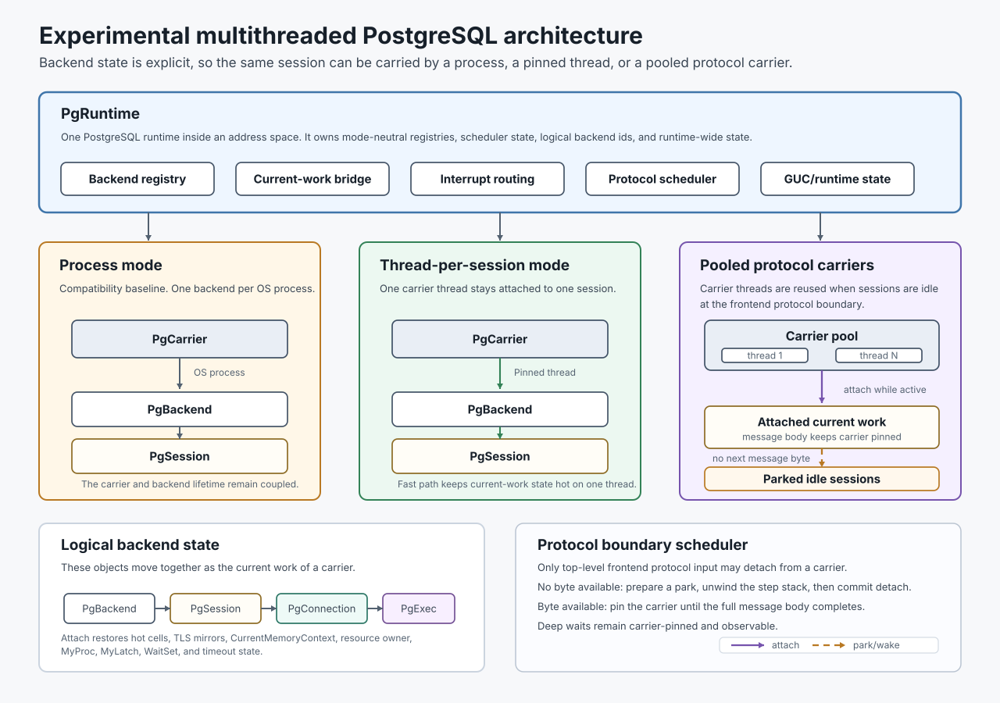

Multithreaded PostgreSQL
========================

This is an experimental PostgreSQL branch where I am exploring native threaded
execution for PostgreSQL backends. The experiment is whether PostgreSQL can
keep its proven process-per-backend model while also gaining a native way to
scale to many more concurrent client connections.

The potential unlock is a PostgreSQL server that can keep the compatibility and
isolation properties of process mode, while also supporting connection patterns
that are difficult today without an external pooler: thousands of mostly-idle
clients, bursty application fleets, and many logical sessions sharing a smaller
set of operating-system processes or carrier threads. Longer term, the same
shape could also make room for more scalable `LISTEN`/`NOTIFY`, live queries,
or embedded sync-engine patterns inside PostgreSQL itself.

I am also using it to explore how far agent-driven development can go on a
large, mature, performance-sensitive C codebase. The implementation has been
done almost entirely through Codex agents; I set direction through plans,
review, benchmarks, and long-running `/goal` sessions.

I started from PostgreSQL `REL_19_BETA1` and added two threaded shapes:

- thread-per-session, where a regular client backend runs on its own thread;
- pooled protocol carriers, where many mostly-idle client sessions can share a
  bounded pool of carrier threads.

This is research and development code. It is not production-ready PostgreSQL.

For reviewers who want the full branch delta from the fork point, see
[PR #1](https://github.com/samwillis/multithreaded-postgres/pull/1). That diff
also includes the Markdown planning documents and work log in this repository,
which inflate the changed-line count by about 35%.

Why This Exists
---------------

PostgreSQL backend code has historically been written around process-private
state and process-global variables. That is a good fit for forked backends, but
it makes native threading and in-server scheduling hard: the server needs to
know which state belongs to the runtime, the carrier, the backend, the session,
the connection, or the current command execution.

This branch makes those ownership boundaries explicit. The design goal is not
to simply wrap `PostgresMain()` in `pthread_create()`, but to separate logical
database work from the physical process or thread currently carrying it. That
opens three useful paths:

- keep normal process mode as the compatibility baseline;
- use thread-per-session mode to prove ordinary backend execution can run in a
  shared address space;
- use pooled protocol carriers to reduce the cost of large populations of
  quiet client connections.

How This Branch Was Built
-------------------------

Most implementation work on this branch has been done by Codex agents. I wrote
and refined the plan for a few hours before starting, then guided the branch
through goals, review, benchmark interpretation, and follow-up priorities. Many
phases were completed by setting a Codex `/goal` and letting the agent work
through implementation, testing, commits, and fixes.

Some goals were short. Others were much longer: Phase 12 ran for up to four
days with Codex continuing without intervention.

The technical inspiration came in part from Thomas Munro's PGConf.dev 2025 talk
on multithreaded PostgreSQL, which I attended. I also work on PGlite, and one
motivation for this work is that a threaded PostgreSQL runtime would make a
multi-session WebAssembly PGlite much more plausible.

Architecture Summary
--------------------



The branch splits backend execution into explicit objects that used to be
mostly implied by process-global state:

- `PgRuntime` is the running PostgreSQL server runtime in one address space.
- `PgCarrier` is the physical process or thread currently executing backend
  work.
- `PgBackend` is the logical backend identity used for interrupts,
  cancellation, `PGPROC`, wait state, and lifecycle ownership.
- `PgSession` is the database session that survives across protocol messages
  and, in pooled mode, across carrier detach/attach cycles.
- `PgConnection` owns frontend/backend protocol and socket state.
- `PgExecution` owns command-execution state that is current only while a
  backend is actively running work.

Process mode maps these objects almost one-to-one onto the existing backend
process. Thread-per-session mode keeps one carrier thread attached to one
session. Pooled mode lets an idle session detach from its carrier while waiting
for the next frontend message, then reattach to an available carrier when the
client sends more input.

The important boundary today is the frontend protocol boundary. A session may
park only before the next protocol message type byte is consumed. After that
byte is read, the carrier remains pinned until the full message body is
complete. This keeps error recovery, protocol synchronization, memory contexts,
resource owners, `MyProc`, `MyLatch`, timeout state, and wait sets attached to
well-defined logical backend state.

What Works Now
--------------

The branch currently supports:

- normal process-per-backend mode;
- thread-per-session mode for regular client backends and in-tree worker
  families that have been moved onto explicit runtime state;
- pooled protocol-carrier mode for frontend protocol input waits;
- session parking and wakeup at the top-level frontend protocol boundary;
- session state preservation while a parked session is resumed by a carrier
  thread;
- logical backend interrupts, cancellation, termination, teardown, reconnect,
  PL/pgSQL, core GUC behavior, and the current in-tree worker runtime scope.

The current scheduler boundary is deliberately narrow. Broader detach/yield
points remain future work.

Important caveats:

- third-party C extensions are not assumed to be thread-safe;
- contrib and bundled procedural-language hardening is still ongoing;
- pooled mode is aimed at many quiet connections, not faster single-query
  throughput;
- connection churn and hot tiny-query paths still need performance work.

How To Build
------------

Build it like PostgreSQL from source:

```sh
./configure --prefix="$PWD/tmp_install" --enable-debug --enable-cassert
make -j"$(nproc)"
make install
```

The normal PostgreSQL process model is still the default. To initialize and run
a process-mode server from the local install:

```sh
tmp_install/bin/initdb -D data
tmp_install/bin/postgres -D data
```

How To Run The Threaded Modes
-----------------------------

Thread-per-session mode uses one carrier thread per backend session:

```sh
tmp_install/bin/postgres -D data \
  -c multithreaded=on \
  -c pooled_protocol_carriers=0
```

Pooled protocol-carrier mode runs client sessions on a bounded carrier pool.
For example, this starts a server with up to 128 protocol carriers:

```sh
tmp_install/bin/postgres -D data \
  -c multithreaded=on \
  -c pooled_protocol_carriers=128
```

In pooled mode, sessions detach only while waiting for the next frontend
protocol message. Once a carrier consumes the next message type byte, that
carrier stays pinned until the full message body is complete.

How To Test
-----------

The focused validation targets for this branch are:

```sh
make check
make check-threaded
make check-threaded-smoke
make check-threaded-150
make check-threaded-200
make check-threaded-world-core
```

These targets were green after the latest full Phase 15 benchmark pass on
June 22, 2026. `check-world` is not currently a green target for this branch.

How To Benchmark
----------------

The benchmark scripts compare vanilla PostgreSQL, this branch in process mode,
thread-per-session mode, and pooled-carrier mode.

Run the full Phase 15 suite by pointing the runner at a vanilla PostgreSQL
install, this branch's install, and the client binaries to use:

```sh
src/tools/benchmark/mtpg_phase15_benchmark_suite.pl \
  --vanilla-install=/path/to/vanilla-postgres/install \
  --branch-install="$PWD/tmp_install" \
  --client-install=/path/to/pgbench/install \
  --profiles=all \
  --out-dir=/tmp/mtpg_phase15_benchmarks
```

The runner has local development defaults, but passing explicit install paths
makes benchmark runs reproducible on a new machine. The lower-level matrix
runner is:

```sh
src/tools/benchmark/mtpg_pgbench_matrix.pl --help
```

Latest benchmark summary:

| Signal | Current result |
| --- | --- |
| Hot tiny-query path | Branch process is 0.907x to 0.934x vanilla; pinned threads are 0.797x to 0.952x vanilla depending on workload. |
| 200 mostly-idle clients, 100 ms wake cycle | Pooled carriers are near process/threaded throughput once the pool is at least 64 carriers; pool 32 shows an `app_mixed` outlier. |
| 1000 mostly-idle clients, `SELECT 1; \sleep 1000 ms; SELECT 1;` | `branch_pool_128` reaches 978 TPS versus 997 TPS for pinned threads, while using 122 server threads instead of 1008. |
| 1000 mostly-idle memory profile | Pooled lanes use about 537 KB to 561 KB PSS per client versus 961 KB for pinned threads, 1062 KB for branch process, and 1212 KB for vanilla. |
| Connection churn | Pooled mode is not yet competitive with process or pinned threads; this remains a known optimization target. |

Detailed results and workload definitions are in
[benchmark results](plan_docs/MULTITHREADED_BENCHMARKS.md).

Project Documents
-----------------

- [Architecture](plan_docs/MULTITHREADED_ARCHITECTURE.md): target object model and
  long-term design.
- [Implementation plan](plan_docs/MULTITHREADED_PLAN.md): staged roadmap and phase
  boundaries.
- [Protocol scheduler design](plan_docs/MULTITHREADED_PROTOCOL_SCHEDULER_DESIGN.md):
  Phase 14/15 protocol-boundary scheduler design.
- [Benchmark results](plan_docs/MULTITHREADED_BENCHMARKS.md): latest Phase 15
  benchmark suite, workload definitions, TPS tables, and memory-footprint
  results.
- [Threading review](plan_docs/MULTITHREADED_THREADING_REVIEW.md): review of
  the branch direction, risks, and historical correctness blockers.

Background and inspiration:

- [PostgreSQL wiki: Multithreading](https://wiki.postgresql.org/wiki/Multithreading)
- [PostgreSQL wiki: Signals](https://wiki.postgresql.org/wiki/Signals)
- [PGConf.dev 2025 Developer Unconference notes](https://wiki.postgresql.org/wiki/PGConf.dev_2025_Developer_Unconference)
- [Investigating Multithreaded PostgreSQL](https://www.youtube.com/watch?v=7BvLaRkaijc)

----

#### Original PostgreSQL README

##### PostgreSQL Database Management System

This directory contains the source code distribution of the PostgreSQL
database management system.

PostgreSQL is an advanced object-relational database management system
that supports an extended subset of the SQL standard, including
transactions, foreign keys, subqueries, triggers, user-defined types
and functions.  This distribution also contains C language bindings.

Copyright and license information can be found in the file COPYRIGHT.

General documentation about this version of PostgreSQL can be found at
<https://www.postgresql.org/docs/devel/>.  In particular, information
about building PostgreSQL from the source code can be found at
<https://www.postgresql.org/docs/devel/installation.html>.

The latest version of this software, and related software, may be
obtained at <https://www.postgresql.org/download/>.  For more information
look at our web site located at <https://www.postgresql.org/>.
